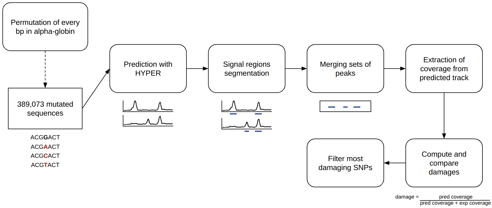

# Permutagenesis with HYPER predictions

In silico saturation mutagenesis (permutagenesis) is a systematic way of testing how changing the sequence at each position affects a model's output. This pipeline takes the coordinates of a 196,608-base-long DNA region, changes one nucleotide at a time to each of the other three possible nucleotides, and measures how much the predicted epigenetic profile changes.



## Intructions

### 1. Generate predictions from mutations

Generate epigenetic predictions on the 344,064 mutated sequences with script ```predict_mutation.py```

**Usage:**

```bash
REGION=chr16:1-196609
LOCUS=Alpha_Globin
GENOME=inputs/hg38_chr16.fa
MODEL=GFIO/Human_Ery
CELL_TYPE=0
THREADS=8

python predict_mutation.py $REGION \
      -e $LOCUS \
      --genome $GENOME \
      -m $MODEL \
      -c $CELL_TYPE \
      -t $THREADS \
```

**Parameters:**

Mandatory:
* ```region```: Specifies the genomic region to analyse using 1-based inclusive coordinates in format ```chr:start-end```. For example: ```chr9:45260000-45261900```.

Optionals:
* ```--base-dir```: Root directory containing the prediction data and generated directories. Default: ```inputs/08_Pipeline_predictions```.
* ```--genome```: Path to the reference genome in FASTA format. Default: ```<base-dir>/hg38_chr16.fa``` (this file only includes chromosome 16 from the hg38 genome assembly).
* ```-e```, ```--experiment```: Name of the locus. This name is also used to construct several default input and output paths. Default: ```Locus```. Example: ```Alpha_Globin```.
* ```--output-dir```: Directory where mutant genomes and their predictions are stored. Default: ```<base-dir>/<experiment>```.
* ```--json-dir```: Directory containing the prediction configuration JSON files. Default: ```inputs/07_JSONs/<experiment>```.
* ```--model-py```: Path to the model skeleton file (```model.py```). This file is copied into each mutant directory before prediction. Default: ```<base-dir>/model.py```.
* ```--pipeline-script```: Script submitted to the scheduler using ```sbatch```. Default: ```inputs/i_Run_Pipeline.sh```.
* ```-m```, ```--model```: Hugging Face model to make predictions. Default: ```GFIO/Human_Ery```.
* ```-c```, ```--cell-type```: Numeric identifier of the cell type to predict. These IDs are defined during the data preparation previous to the training of the model and are usually found in the ```04_Dataset/collection.txt``` file. For example: ```-c 3```.
* ```--tag```: Prefix name for the predicted files. Default: ```pred```.
* ```--pad```: Half-width, in base pairs, of the model input window around the region of interest. Default: ```98304```.
* ```-b```, ```--batch-size```: Maximum number of mutant genomes processed at once. Each active mutant retains a full copy of the chromosome on disk until its batch has finished. Increasing this value can increase parallelism but also increases temporary disk usage. Default: ```30```.
* ```-t```, ```--threads```: Number of parallel FASTA-writing workers.. Default: ```4```.
* ```--no-index```: Skip creation of the FASTA index with ```samtools faidx```.
* ```--keep-fasta```: Keep mutant genome FASTA files after prediction instead of deleting them.
* ```-n```, ```--dry-run```: Perform a dry run. Reports what would be submitted without actually submitting the prediction jobs.
* ```-v```, ```--verbose```: Enable verbose/debug logging.

> [!WARNING]
> This action will require a considerable amount of disk space and execution time.
   
### 2. Analyse the most damaging variant effects across the locus

TO DO

## Requirements

* Python
* BioPython
* Samtools
